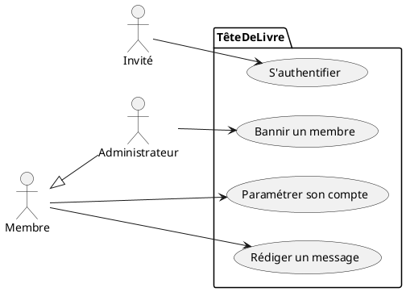

# Episode 01 : Let's go !

## Rappel UML : UML et le Diagramme de Cas d'Utilisation

L'UML (Unified Modeling Language) est un langage "visuel" ; ce n'est pas une méthodologie.  
Il supporte : 
- la **visualisation** du système,
- l'**aide** à la construction du système,
- la **spécification** de la structure et du comportement du système,
- la **documentation** des décisions.

💡 En ingénierie du bâtiment, on utilise des plans, en ingénierie électrique on utilise des schémas électriques ; en ingénierie logicielle, on utilise l'UML.   

Pour ce challenge, on va vous demander de réaliser des **diagrammes de cas d'utilisation**. Ce type de diagramme **montre ce que fait le système et qui l'utilise**, il est composé de 3 éléments principaux : 
- un **Acteur** (on définit uniquement les acteurs externes physiques et logiques) : il s'agit d'une personne ou d'une entité ("chose") qui va interagir avec le système. On identifie un acteur à l’aide de son nom, qui lui est attribué en fonction du rôle que l’acteur joue par rapport au système. (Ex : invité, utilisateur, etc.). On note toutefois qu’une même personne peut jouer plusieurs rôles, tout comme plusieurs personnes peuvent jouer un même rôle.
- une **Relation entre acteurs** : il n’existe qu’une relation entre acteurs, la généralisation. Un acteur « est un » autre acteur. (Exemple : une personne « est un » être humain).  
- un **Cas d'utilisation** : il s’agit d’un comportement réalisé par le système, il est décrit par une séquence d’actions connectées. Pour nommer un cas d’utilisation, on se place du point de vue de l’acteur qui déclenche celui-ci. On utilise un verbe à l’infinitif et, si besoin, une simple combinaison verbe-nom. Ce nom doit être unique, intuitif et auto-explicatif. (Exemple : s'authentifier, paramétrer son compte, etc.).

Un diagramme de cas d'utilisation permet de définir le système du point de vue des ~~développeurs~~ **utilisateurs**.  
Il permet donc de structurer les besoins (cahier des charges), mais aussi le reste du développement.  

Vous retrouverez un exemple de diagramme de cas d'utilisation ci-dessous : 



Pour réaliser vos diagrammes UML, on vous recommande d'utiliser [PlantUML](https://plantuml.com/), que vous pouvez [télécharger ici](https://plantuml.com/download). Il existe également une [extension VSCode](https://marketplace.visualstudio.com/items?itemName=jebbs.plantuml). 

Vous retrouverez la section de la [documentation de PlantUML dédiée aux diagrammes de cas d'utilisation ici.](https://plantuml.com/use-case-diagram).

Cela vous permettra donc de mettre vos fichiers PlantUML (diagrammes) dans un repo Git ! 

## Enoncé Challenge Jour-01

Bonjour et encore une fois, bienvenue chez O'Clock ! On vous souhaite le meilleur pour votre formation CDA ! 🎉  

Pour votre premier jour, on vous demande de commencer la partie conception d'un projet. On vous demande de réaliser des diagrammes de cas d'utilisation ainsi que des maquettes, à partir de votre prise de note et de vos wireframes (maquettes de type "fil de fer") prises lors d'un rendez-vous client.    

**Contexte**

Vous êtes un autoentrepreneur (un "freelancer" comme on dit chez les GenZ). Vos talents de développements hors pairs ne sont pas passés inaperçus et par bouche-à-oreille, un client vous a contacté. Après plusieurs appels et grâce à vos skills de *Salesdog* aguerri, vous êtes invité au siège social du client.  

À la suite de ce rendez-vous, vous décrochez la prestation (congrats! 🍾). Dès lors, vous commencez la partie conception du projet. Vous mettez vos compétences de gestion de projet à l'épreuve et vous vous auto-assignez 2 tâches :

1. Conception d'un/plusieurs diagrammes de cas d'utilisation
2. Conception de maquettes (attention on parle ici de mockup, et non pas de wireframe)
Pour les maquettes, vous pouvez utiliser l'outils que vous préférez. Si vous n'en avez pas, on vous conseille Figma ;)
3. Préparer des questions pour éclaircir les zones d'ombres avec le client. Critiquer certains choix pour apporter votre expertise.

Pour vous aider dans cette tâche, vous pouvez reprendre les notes que vous avez prises lors du premier rendez-vous client, ainsi que de vos wireframes gribouillées sur un bout de papier.  

**Notes meeting client**

```
My Planner : le 19 Septembre. 
Titre : Notes 1er RDV client.  
Client : The Marvelous Corporation.

- CEO veut site vitrine pour exposer des projets digitaux (publics, charités, etc. - pas de projets privés/confidentiels !). 
- Projets s'affichent comme une liste de "cartes".
- CTO veut afficher le nom de la techno avec une pastille pour chaque projet. 
- Informations de contact en bas de la page du site. 
- Séparation claire entre la partie métier ("back") et Web UI ("front").
- Pas de connexion, site public vitrine. 
- Click sur un projet -> page de projet, affiche informations spécifiques au projet. 
- Technologies front-end : raw HTML/CSS/JS (pas de framework sauf frameworks front-end de type bootstrap).  
- Logo customisable en haut du site vitrine, avec le nom de l'entreprise en gros. 
```

**Wireframes meeting client**

Page d'accueil :

  

Page de projet :


**Et maintenant ?**

À vous de jouer 🫵 💪
